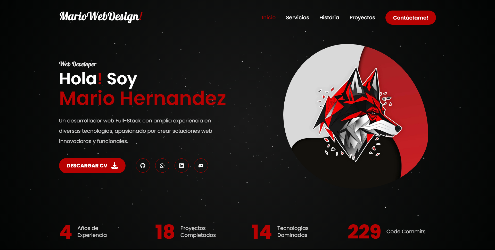

<div align="center">
  <a href="https://mariowebdesign.vercel.app" target="_blank">
   
  </a>
</div>

<br>
<div align="center">

[](https://mariowebdesign.vercel.app)

[](https://github.com/Marioalf2002)


[](https://wa.me/message/MC62R3PTOHVDN1)
[](https://t.me/mariowebdesing)
[](https://mail.google.com/mail/?view=cm&fs=1&to=mariowebdesing@proton.me)
[](https://www.linkedin.com/in/mariowebdesign)
[](https://discordapp.com/users/744348258893168680)

</div>

# [English](README_ENGLISH.md)

Read this in other languages: [English](README_ENGLISH.md)

# [MarioWebDesign](https://mariowebdesign.vercel.app/)

[Portafolio de Mario Hernandez - Web Designer & Developer - Full Stack Developer - Frontend Developer - Backend Developer](https://mariowebdesign.vercel.app/)

## [Acerca de mi](https://mariowebdesign.vercel.app/)

Soy un apasionado del diseño & desarrollo web, me encanta crear sitios web & aplicaciones web que sean atractivas, funcionales & accesibles para todos. Me especializo en el desarrollo de sitios web & aplicaciones web utilizando tecnologías modernas como HTML5, CSS3, JavaScript, ReactJS, Next.js, Node.js, MongoDB, PHP, entre otras.

## [Links](https://mariowebdesign.vercel.app/)

- [Website](https://mariowebdesign.vercel.app/)
- [Telegram](https://t.me/mariowebdesing)
- [LinkedIn](https://www.linkedin.com/in/mariowebdesign)
- [GitHub](https://github.com/Marioalf2002)
- [Discord](https://discordapp.com/users/744348258893168680)

## [Contacto](https://mariowebdesign.vercel.app/)

- Email: [mariowebdesing@proton.me](https://mail.google.com/mail/?view=cm&fs=1&to=mariowebdesing@proton.me)
- Teléfono: [(+57) 324 777 3515](https://wa.me/message/MC62R3PTOHVDN1)

## Instalación

1. Clona el repositorio

   ```sh
   git clone https://github.com/Marioalf2002/Portfolio_MarioWebDesign.git
   ```

2. Instala los paquetes NPM

   ```sh
    npm install
   ```

3. Actualiza Dependencias

   ```sh
    npm update
   ```

## Crear archivo .env.local

Agrega las siguientes variables de entorno en el archivo .env.local

```sh
NEXT_PUBLIC_GITHUB_TOKEN= TOKEN_GITHUB
NEXT_PUBLIC_GITHUB_USERNAME= USERNAME_GITHUB
RESEND_API_KEY= TOKEN_API_KEY
```

El Token de Github lo puedes obtener en [Github Developer](https://docs.github.com/en/rest/guides/getting-started-with-the-rest-api), y debe tener los permisos de lectura de repositorios (Contents y Metadata).
