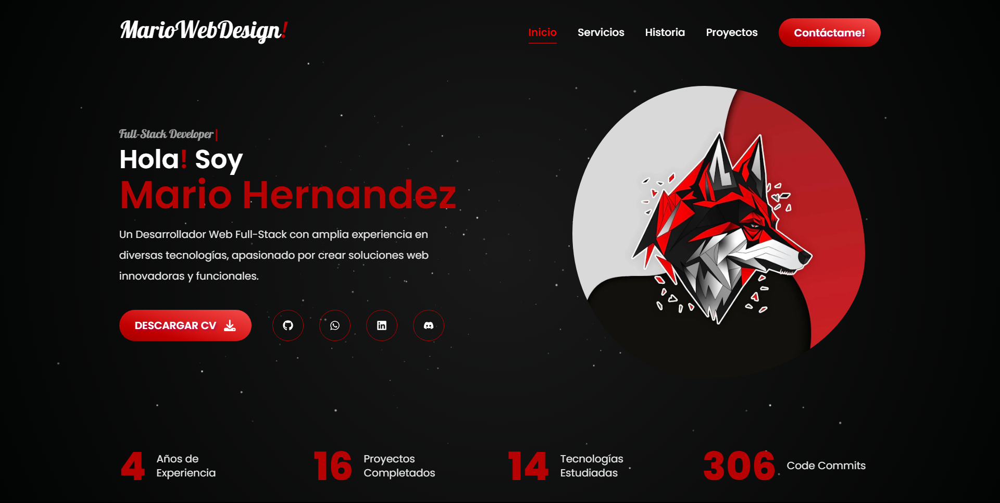

<div align="center">
  <a href="https://mariowebdesigns.com" target="_blank">
   
  </a>
</div>

<br>
<div align="center">

[](https://mariowebdesigns.com)

[](https://github.com/Marioalf2002)


[](https://wa.me/message/MC62R3PTOHVDN1)
[](https://t.me/mariowebdesing)
[](https://mail.google.com/mail/?view=cm&fs=1&to=marioalf200216@gmail.com)
[](https://www.linkedin.com/in/mariowebdesign)
[](https://discordapp.com/users/744348258893168680)

</div>

# [Spanish](README.md)

Read this in other languages: [Spanish](README.md)

# [MarioWebDesign](https://mariowebdesigns.com/)

[Portfolio Mario Hernandez - Web Designer & Developer - Full Stack Developer - Frontend Developer - Backend Developer](https://mariowebdesigns.com/)

## [About me](https://mariowebdesigns.com/)

I am passionate about web design & development. I love creating websites & web applications that are attractive, functional, & accessible to everyone. I specialize in developing websites & web applications using modern technologies such as HTML5, CSS3, JavaScript, ReactJS, Next.js, Node.js, MongoDB, PHP, among others.

## [Links](https://mariowebdesigns.com/)

- [Website](https://mariowebdesigns.com/)
- [Telegram](https://t.me/mariowebdesing)
- [LinkedIn](https://www.linkedin.com/in/mariowebdesign)
- [GitHub](https://github.com/Marioalf2002)
- [Discord](https://discordapp.com/users/744348258893168680)

## [Contact](https://mariowebdesigns.com/)

- Email: [marioalf200216@gmail.com](https://mail.google.com/mail/?view=cm&fs=1&to=marioalf200216@gmail.com)
- Teléfono: [(+57) 324 777 3515](https://wa.me/message/MC62R3PTOHVDN1)

## Instalation

1. Clone the repository

   ```sh
   git clone https://github.com/Marioalf2002/Portfolio_MarioWebDesign.git
   ```

2. Install NPM packages

   ```sh
    npm install
   ```

3. Update Dependencies

   ```sh
    npm update
   ```

## Create .env.local file

Add the following environment variables to the .env.local file

```sh
NEXT_PUBLIC_GITHUB_TOKEN= TOKEN_GITHUB
NEXT_PUBLIC_GITHUB_USERNAME= USERNAME_GITHUB
RESEND_API_KEY= TOKEN_API_KEY
```

The Github Token can be obtained at [Github Developer](https://docs.github.com/en/rest/guides/getting-started-with-the-rest-api), and must have read permissions for repositories (Contents and Metadata).
